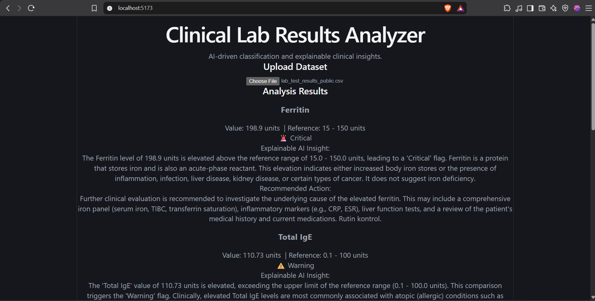
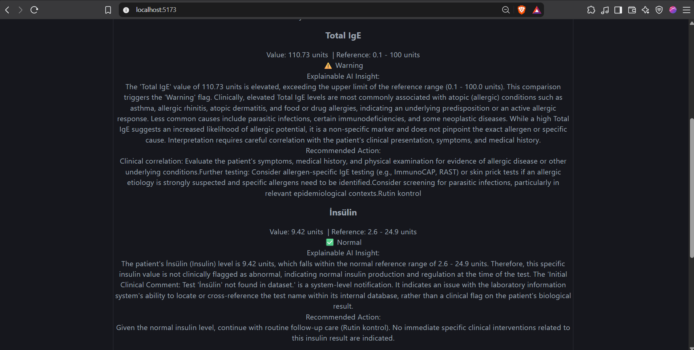

# Aragen GenAI - Clinical Lab Results Analyzer

A full-scale, AI-driven full-stack web application designed to parse, validate, classify, and explain clinical laboratory test results using the principles of Explainable AI (XAI) and the Model Context Protocol (MCP).

---

## Architecture & Tech Stack

*   **Backend**: Python, FastAPI, Model Context Protocol (`mcp` server), Pandas, Pydantic.
*   **Frontend**: React, Vite, Tailwind CSS, PapaParse (for client-side CSV processing).
*   **AI Provider**: Google Gemini API (`gemini-3.5-flash-lite`) with structured JSON output enforcement.
*   **Data Source**: Anonymized Clinical Laboratory Test Results dataset (`lab_test_results_public.csv`).

```
[React Frontend / CSV Upload] 
       │
       ▼ (HTTP POST)
[FastAPI Backend Router] 
       │
       ├─► [MCP Server Tools (Validation, Range Lookup, Recommended Followup)]
       │
       ├─► [Gemini LLM (Explainable AI Clinical Insights)]
       │
       ▼
[Severity-Based Routing & Color-Coded Display]
```

## Project Structure

```
Aragen-GenAI/
├── backend/
│   ├── main.py          # FastAPI application & entry point
│   ├── agent.py         # AI Agent pipeline (Classify → Explain → Route)
│   ├── mcp_server.py    # MCP Server exposing tools for reference lookup & validation
│   └── requirements.txt # Python dependencies
├── frontend/
│   ├── src/
│   │   ├── components/
│   │   │   ├── LabInput.jsx       # CSV upload & parsing component
│   │   │   ├── ResultsDisplay.jsx # Classified results layout
│   │   │   └── SeverityBadge.jsx  # Color-coded severity badge (🚨 / ⚠️ / ✓)
│   │   ├── App.jsx
│   │   └── main.jsx
│   └── package.json
├── assets/              # Screenshots, GIFs, and demo videos
├── lab_test_results_public.csv
├── metadata.json
└── README.md
```

## Setup & Installation

### 1. Backend Setup

Open a terminal, navigate to the `backend/` folder, install dependencies, and configure your environment variables.

```bash
cd backend
pip install -r requirements.txt
```

Create a `.env` file inside the `backend/` directory and add your Google Gemini API key:

```
GEMINI_API_KEY=your_actual_gemini_api_key_here
```

Start the FastAPI server:

```bash
python main.py
```

*(The server runs locally on `http://localhost:8000`)*

### 2. Frontend Setup

Open a separate terminal window, navigate to the `frontend/` folder, install dependencies, and run the development server.

```bash
cd frontend
npm install
npm run dev
```

*(The application runs locally on `http://localhost:5173`)*

## How to Test

1. Ensure both the FastAPI backend and React frontend are running.
2. Open your browser and navigate to `http://localhost:5173`.
3. Click the file upload input and select the provided `lab_test_results_public.csv` file.
4. The system automatically parses the dataset, routes the data through the MCP validation server, flags abnormal parameters, queries Gemini for Explainable AI insights, and sorts results by severity (`Critical` → `Warning` → `Normal`).

## Visual Demonstration

Below are demonstrations of the application workflow and user interface.




### Application Dashboard & CSV Upload

*Upload interface allowing seamless parsing of biochemical and hematological lab parameters.*

### Severity Classification & Explainable AI Insights

*Color-coded status badges (🚨 Critical, ⚠️ Warning, ✓ Normal) paired with granular clinical explanations and dataset follow-up actions.*

### Video Walkthrough

*End-to-end demonstration showcasing backend MCP communication, agent routing, and frontend rendering.*
